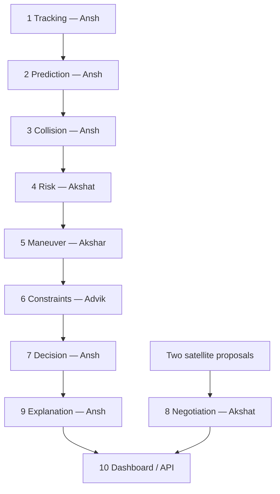

# Orbital Guardian — How to execute the complete project

## What you received

An integrated hackathon application combining all ten uploaded packages.
One Python server runs the agent pipeline and serves the interactive 3D dashboard.
You do **not** need to start ten separate servers, install Node.js, or build a frontend.

The default run uses synthetic orbital objects, SGP4 predictions, calculated
conjunctions, maneuver candidates, mission checks, and a deterministic explanation.
No API keys or live orbital-data downloads are required after dependency installation.

Start here rather than following the older instructions inside individual agent packages.

## 1. Requirements

- Python **3.11 or 3.12**, with pip and venv. Verification used Python 3.12.
- A recent Chrome, Edge, Firefox, or Safari browser.
- Internet access for the initial `pip install` only.
- Extract the ZIP first. Run commands from the extracted `orbital_guardian` folder,
  the directory containing `run.py` and `requirements.txt`.

## 2. Windows — PowerShell

```powershell
cd path\to\orbital_guardian
py -3.12 -m venv .venv
.\.venv\Scripts\python.exe -m pip install --upgrade pip
.\.venv\Scripts\python.exe -m pip install -r requirements.txt
.\.venv\Scripts\python.exe run.py
```

If Python 3.11 is installed instead, replace `py -3.12` with `py -3.11`.
These commands call the virtual environment directly, so PowerShell execution-policy
changes and activation scripts are unnecessary.

## 3. macOS / Linux

```bash
cd path/to/orbital_guardian
python3 -m venv .venv
.venv/bin/python -m pip install --upgrade pip
.venv/bin/python -m pip install -r requirements.txt
.venv/bin/python run.py
```

## 4. Open the application

Open **http://127.0.0.1:8000** in your browser.

- Dashboard: http://127.0.0.1:8000
- Interactive API documentation: http://127.0.0.1:8000/docs
- Health check: http://127.0.0.1:8000/health

Keep the terminal open while demonstrating. Press **Ctrl+C** to stop.
Next time, run only the final `python run.py` command using your virtual environment.

If port 8000 is occupied:

```bash
# Use your virtual environment's Python executable:
python run.py --port 8001
```

Then open http://127.0.0.1:8001. Development reload is optional: `python run.py --reload`.
Run a single worker: the background run status is held in one Python process.

## 5. Hackathon demo — five clicks

1. Keep **20 objects** and a **2-hour window**, then click **Run simulation**.
2. Watch Agent activity. Wait until the header says **completed**.
3. Select the RED encounter, normally **SIM-90001 / SIM-90002**.
4. Click **Jump to encounter**, then **Preview maneuver**.
5. Compare the original and proposed paths, new miss distance, and operator briefing.

Drag the globe to rotate it; scroll to zoom. Playback supports 1×, 60×, and 300×,
plus pause and a time slider. The magnified encounter panel makes the small path
change visible at a useful scale. A kilometer-scale change is tiny at Earth scale.

**Download run JSON** exports the calculated snapshot for your presentation.
**Reset view** resets the camera/playback; it does not recompute or erase results.
**Run simulation** starts a fresh catalog and clears the previous run's derived results.
Operator constraints persist between runs.

The seeded example was verified to produce approximately:

| Item | Verified example |
| --- | --- |
| Original closest distance | 120 m |
| Encounter time | About 40 minutes after the run epoch |
| Initial tier | RED |
| Initial Pc under assumed uncertainty | About 0.0039 |
| Selected delta-v | 0.4 m/s, along-track |
| New closest distance | About 1.2 km |

These are calculated demo results, not hardcoded UI values. The run epoch and
incidental background encounters can change the exact numbers.

## 6. Project architecture and team ownership



The integrated code calls each agent's Python entry point through adapters. JSON
contracts remain the boundaries; separate HTTP services are unnecessary for this demo.
Low-risk branches go directly to the Decision and Explanation agents.

| Agent | Actual implementation in this project |
| --- | --- |
| 1 Tracking | Team synthetic generator; optional CelesTrak ingestion adapter |
| 2 Prediction | Team Skyfield/SGP4 implementation, GCRS coordinates labeled ECI_J2000 in the existing contract |
| 3 Collision | Team KD-tree screening and refined closest approach; coarse padding enabled |
| 4 Risk | Team risk classification; corrected Gaussian encounter-plane probability integration |
| 5 Maneuver | Team two-body candidate generator, plus integration adapter for consistent nominal-path comparison and re-solving closest approach |
| 6 Mission constraints | Team fuel/altitude/coverage rules plus moving-catalog trajectory recheck in the adapter |
| 7 Decision | Team deterministic selection and explicit no-viable-option escalation |
| 8 Negotiation | Team two-proposal negotiation, available through `POST /negotiate` |
| 9 Explanation | Team explanation/guardrail code; mock provider by default; optional Gemini/Groq configuration |
| 10 Dashboard / API | Supplied FastAPI orchestration base with integrated adapters, run status, reports, export, and a new interactive 3D view |

Agent 8 is deliberately optional: the default seeded encounters are satellite/debris
cases. Its endpoint accepts two already-computed satellite proposals; this release
does not automatically plan for both satellites or execute a negotiated maneuver.

## 7. Files to know

| Path | Purpose |
| --- | --- |
| `run.py` | Single application launcher |
| `requirements.txt` | Shared dependencies |
| `app/main.py` | HTTP API, background run status, dashboard serving |
| `app/pipeline.py` | Order in which agents run |
| `app/integration/adapters.py` | Translates the team's mismatched contracts and connects actual implementations |
| `app/agents/registry.py` | Registry pointing to integrated adapters |
| `app/state/store.py` | SQLite storage |
| `static/` | Local dashboard HTML, CSS, and JavaScript; no CDN dependencies |
| `contributors/` | Extracted agent packages, including documented integration fixes |
| `original_archives/` | All ten original uploaded ZIPs, unchanged |
| `tests/` | Integrated regression tests |
| `docs/INTEGRATION_NOTES.md` | Fixes, assumptions, limitations, and verification notes |

The original Module 10 reference implementations remain in `app/agents/` for
comparison but are **not registered in the runtime pipeline**. Historical module
documentation is retained; this guide describes the integrated version.

## 8. Verify the installation

Use the virtual environment's Python executable:

```bash
python -m pytest -q
```

The root `pytest.ini` selects the integrated tests. Contributor tests are preserved
but several assume their original standalone import paths and API schemas; do not
treat a recursive test collection across every historical package as this application's
integration suite.

Core regression coverage includes an analytical probability check, between-sample
closest approach, the full pipeline, selected trajectory continuity, report generation,
zero-fuel escalation, negotiation, operator constraint parsing, API validation, and clean
repeated runs. Tests use a separate temporary database.

## 9. Useful API calls

You can make these requests in `/docs` without using the terminal.

| Method | Endpoint | Purpose |
| --- | --- | --- |
| GET | `/health` | Service check |
| POST | `/simulate/start` | Start the full synthetic pipeline |
| GET | `/simulate/status` | idle / running / completed / partial / failed |
| GET | `/snapshot` | Catalog, ephemerides, risks, decisions, reports |
| GET | `/agent-status` | Integration status |
| GET | `/agent-log` | Live server-sent activity events |
| GET | `/catalog` | Current catalog |
| GET | `/ephemerides` | Read stored paths without re-propagating |
| GET | `/conjunctions` | Stored close approaches |
| GET | `/risks` | All risk records |
| GET | `/decisions` | Selected decisions |
| GET | `/reports` | Explanations |
| POST | `/maneuvers/{primary}` | Replan an existing primary using updated constraints |
| POST | `/operator-command` | Parse and store global constraints |
| POST | `/negotiate` | Optional two-satellite negotiation |

Start-request body:

```json
{"object_count":20,"window_hours":2,"guaranteed_conjunctions":1}
```

Example with curl on macOS/Linux:

```bash
curl -X POST http://127.0.0.1:8000/simulate/start \
  -H 'Content-Type: application/json' \
  -d '{"object_count":20,"window_hours":2,"guaranteed_conjunctions":1}'
curl http://127.0.0.1:8000/simulate/status
```

Constraints example:

```json
{"text":"limit fuel to 1%"}
```

The offline parser supports a small set of phrases. It is not unrestricted natural-language
understanding. To restore the default limits, submit:

```json
{"text":"altitude 400 to 800 km and limit fuel to 5%"}
```

Zero-fuel replanning example for `/maneuvers/SIM-90001` after a run:

```json
{"constraints":{"max_fuel_budget_pct_remaining":0}}
```

This should produce `ESCALATE_NO_VIABLE_OPTION` for the RED seeded encounter.

Negotiation example for `/negotiate`:

```json
{
  "conjunction_id":"SAT-A_vs_SAT-B",
  "proposals":[
    {"object_id":"SAT-A","min_dv_ms_to_clear":0.4,"fuel_remaining_pct":60},
    {"object_id":"SAT-B","min_dv_ms_to_clear":0.7,"fuel_remaining_pct":40}
  ]
}
```

The result should choose SAT-A. Inputs are example proposals, not orbital measurements.

## 10. Optional external services

Keep `LLM_PROVIDER=mock` for the dependable demo. If you want real generated prose,
install `requirements-llm.txt` and set environment variables **before** starting the server.

For Groq, set `LLM_PROVIDER=groq`, `GROQ_API_KEY`, and `GROQ_MODEL` to a model available
in your account. For Gemini, set `LLM_PROVIDER=gemini`, `GEMINI_API_KEY`, and `GEMINI_MODEL`.
The supplied default model names are historical; model availability and billing were not
verified. Do not rely on them for the hackathon without a separate provider test.

PowerShell environment syntax: `$env:LLM_PROVIDER="mock"`.
macOS/Linux syntax: `export LLM_PROVIDER=mock`.
The example `.env` file is a reference; this launcher does **not** automatically load it.
Never commit API keys.

The manual `/catalog/refresh` route also exposes CelesTrak mode, followed by `/propagate`
and `/conjunctions?refresh=true`. The one-click simulation intentionally uses synthetic
data. The inherited CelesTrak adapter uses legacy TLE ingestion and is not a complete
modern catalog ingestion solution. Live services were not used in verification.

## 11. Troubleshooting

| Symptom | Action |
| --- | --- |
| `ModuleNotFoundError` | Install the root requirements with the same virtual-environment Python used to run the app. |
| Port already in use | Use `run.py --port 8001`. |
| Page will not connect | Keep the server terminal open and use the port printed there. |
| Header says partial or failed | Read Agent activity and `/simulate/status`; the error is explicit. |
| Requests return 409 | Wait for the active simulation to finish before changing input data. |
| No maneuver appears | Select a RED encounter; green events legitimately need no action. Also check previously stored fuel constraints. |
| LLM startup error | Remove external provider settings or set `LLM_PROVIDER=mock`, then restart. |
| Constraints seem ignored | The mock parser recognizes limited wording. Inspect the parsed JSON; stored limits affect the next run or explicit replan. |
| Orbit change looks tiny | Use the magnified encounter panel and before/after distances. The main globe uses orbital scale. |
| Need a clean database | Stop the server and rename `orbital_guardian.db` to a backup name, then restart. A fresh database is created. |

## 12. What to say in the presentation

“Orbital Guardian connects our team's agents into one mission console. It propagates
orbital objects, finds close approaches, assesses risk under stated uncertainty assumptions,
tests avoidance maneuvers, checks mission limits, and explains the selected plan. Our
interactive 3D simulation shows the original and proposed trajectories.”

Be precise about the demo: uncertainty is assumed, fuel use is a delta-v budget proxy,
coverage checks are heuristic, and the maneuver trajectory is an approximation. No real
satellite control or operational collision-avoidance assurance is provided.
